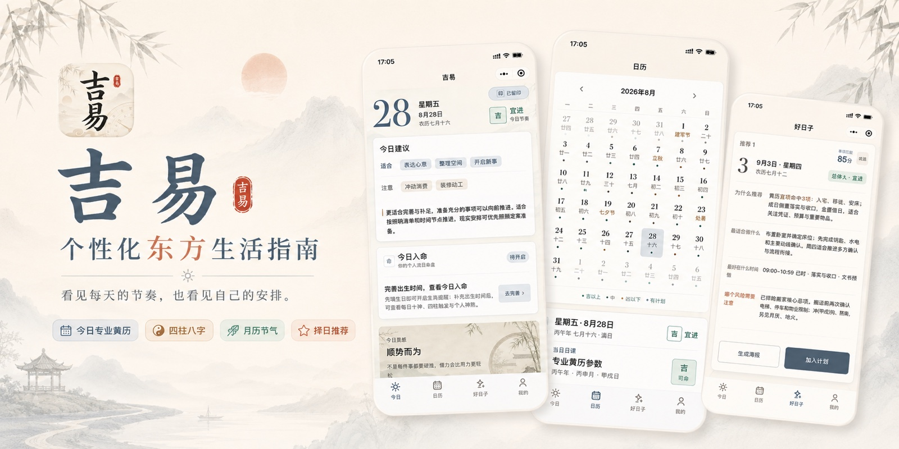
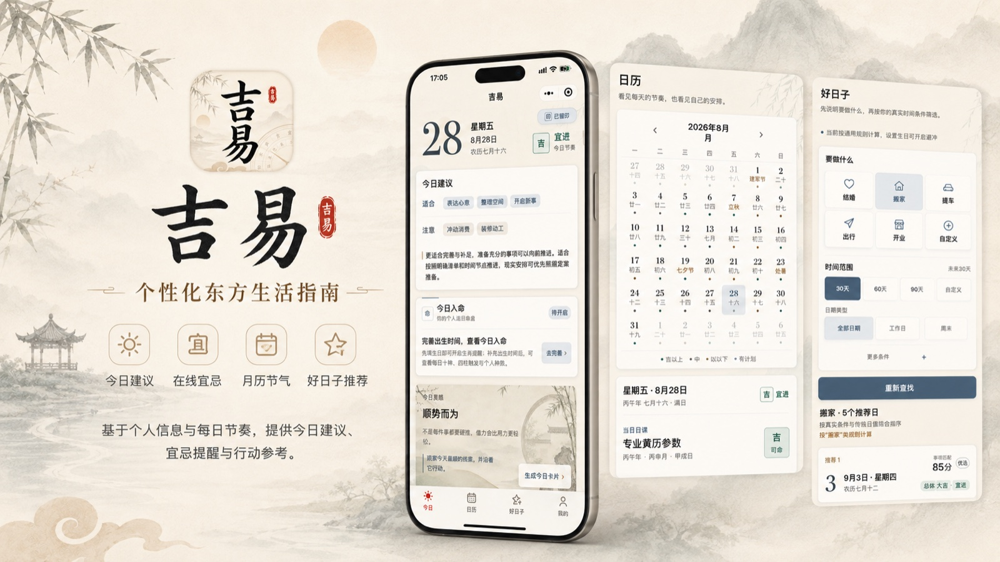
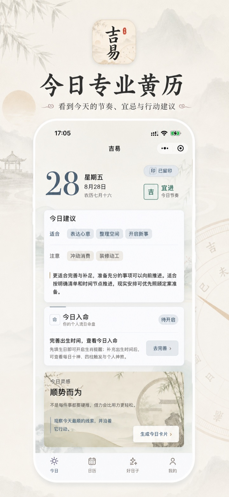
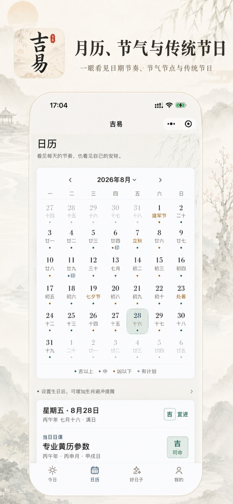
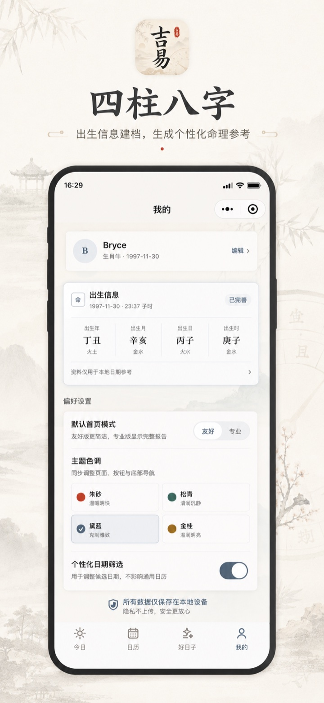
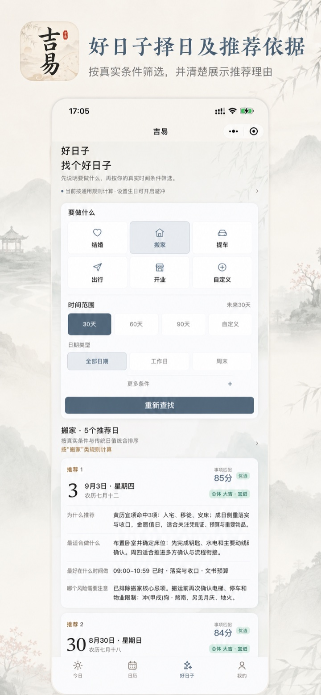
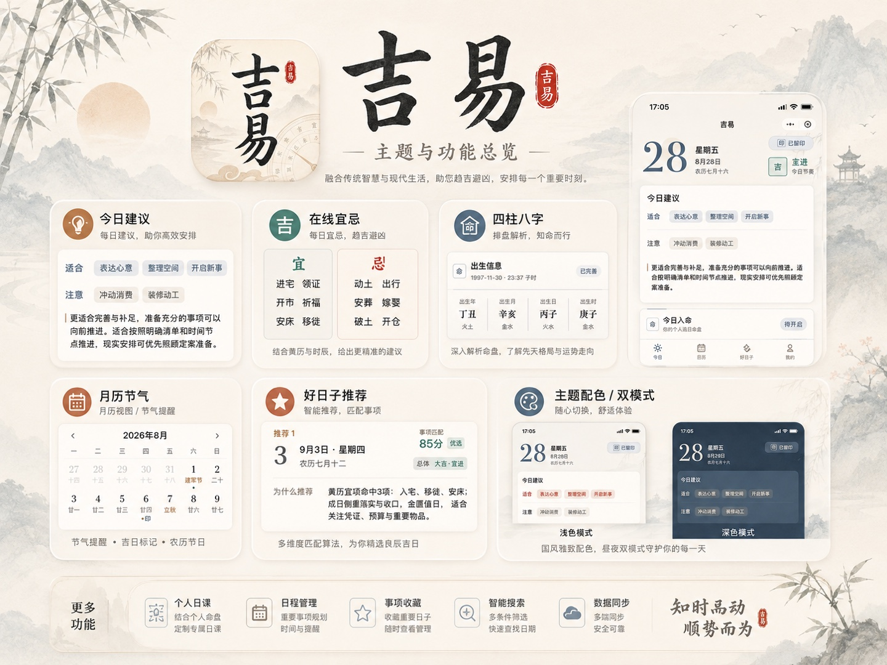
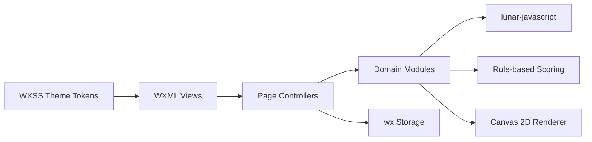

# 吉易 Jiyi

<p align="center">
  
</p>

<p align="center">
  <strong>Local-first Chinese Almanac, Bazi / Four Pillars and Auspicious Date Selection for WeChat Mini Program</strong><br />
  纯前端黄历 · 农历节气 · 四柱八字 · 命理规则 · 择日推荐
</p>

<p align="center">
  
  
  
  
  
</p>



**吉易 Jiyi** 是一个使用微信小程序原生技术构建的东方历法应用，也是一套可运行的 Chinese Almanac / Huangli、Bazi / Four Pillars、Lunar Calendar 与 Auspicious Date Selection 前端实现。

项目基于 [`lunar-javascript`](https://github.com/6tail/lunar-javascript) 在客户端完成公历农历转换、节气节日、干支黄历、四柱八字与择日数据计算；不依赖云函数、云数据库、业务后端或远程 API。用户资料、偏好、留印和计划均通过微信本地存储保存在当前设备。

> This repository focuses on client-side calendar computation, rule-based recommendation, local data persistence and native WeChat Mini Program UI engineering.

## Product Preview / 产品预览



<table>
  <tr>
    <td width="25%" align="center" valign="top"><br /><strong>Daily Huangli</strong><br />今日黄历</td>
    <td width="25%" align="center" valign="top"><br /><strong>Lunar Calendar</strong><br />农历节气</td>
    <td width="25%" align="center" valign="top"><br /><strong>Bazi / Four Pillars</strong><br />四柱八字</td>
    <td width="25%" align="center" valign="top"><br /><strong>Date Selection</strong><br />择日推荐</td>
  </tr>
</table>

## Core Capabilities / 核心能力

| Module | Technical implementation | 用户能力 |
|---|---|---|
| **Calendar Engine** | Solar/Lunar conversion, Gan-Zhi cycle, 24 Solar Terms, festivals | 公历、农历、干支、二十四节气与传统节日 |
| **Chinese Almanac / Huangli** | Yi/Ji, Chong-Sha, Zhi-Shen, Ji-Shi, Jian-Chu, Shen-Sha, 28 Mansions, Nine Stars | 宜忌、冲煞、值神、吉时、建除、神煞、星宿与九星 |
| **Bazi / Four Pillars** | Birth date and time to Year, Month, Day and Hour Pillars; Day Master, Five Elements and Ten Gods | 四柱排盘、日主、五行、十神与干支关系 |
| **Date Selection Engine** | Rule matching, date range, weekday/weekend, time window, exclusion dates and explainable ranking | 婚嫁、搬家、提车、出行、开业及自定义事项择日 |
| **Plans & Check-ins** | Local state machine for upcoming, today and completed plans | 候选日期保存、计划状态、日历标记与每日留印 |
| **Poster Renderer** | Canvas 2D composition, local image assets and client-side export | 三种东方构图海报与本地保存 |
| **Theme System** | Shared semantic tokens across WXML/WXSS and runtime theme state | 朱砂、松青、黛蓝、金桂四套主题 |



## Architecture / 技术架构



- **Native stack**: WXML + WXSS + JavaScript，没有跨端框架运行时。
- **Local-first**: 核心计算、用户状态与海报生成全部在客户端完成。
- **Deterministic calendar data**: 同一日期通过统一历法数据源生成今日、日历与择日页面数据。
- **Explainable recommendation**: 推荐结果保留规则命中、时间约束、风险提示和排序依据。
- **Lightweight delivery**: 页面按微信小程序机制加载，`docs/` 与设计源文件不进入上传包。

## Source Layout / 目录结构

```text
assets/       Runtime backgrounds, scene icons and tab bar assets
data/         Local inspiration, terminology and visual asset configuration
pages/        Today, calendar, date selection, plans, poster and profile pages
styles/       Shared design tokens and common WXSS
utils/        Calendar, Bazi, scoring, plans, themes, poster and local state logic
docs/assets/  Public GitHub screenshots and repository artwork
```

Key modules:

- [`utils/calendar.js`](utils/calendar.js): 历法与黄历数据适配
- [`utils/bazi.js`](utils/bazi.js): 四柱、五行、十神与个人日期关系
- [`utils/poster-renderer.js`](utils/poster-renderer.js): Canvas 2D 海报渲染
- [`utils/plans.js`](utils/plans.js): 本地计划数据与状态流转
- [`utils/theme.js`](utils/theme.js): 多主题语义色与页面同步
- [`data/almanac-terms.js`](data/almanac-terms.js): 专业术语内容与解释

## Run Locally / 本地运行

```bash
git clone https://github.com/BryceYuuu/jiyi.git
cd jiyi
npm install
```

1. 在微信开发者工具中导入仓库根目录。
2. 执行 **工具 → 构建 npm**。
3. 使用自己的小程序 AppID，或选择测试号进行本地调试。
4. 点击 **编译**、**预览**或**真机调试**。

Runtime dependency:

```json
{
  "lunar-javascript": "^1.7.4"
}
```

## Privacy & Scope / 隐私与边界

- 无登录、无支付、无广告 SDK，也不上传个人资料到业务服务器。
- 昵称、生日、出生时间、主题、留印和计划保存在微信本地缓存。
- 相册权限仅在用户主动选择头像或保存海报时调用。
- 黄历、八字、命理、算命和择日内容用于传统文化研究、前端工程演示与生活参考，不构成专业建议，也不承诺现实结果。

完整说明见 [PRIVACY.md](PRIVACY.md)，安全问题见 [SECURITY.md](SECURITY.md)。

## Search Keywords / 搜索关键词

**中文**：微信小程序、黄历、万年历、农历、日历、二十四节气、传统节日、八字、四柱八字、命理、算命、五行、十神、神煞、冲煞、吉时、择日、好日子、东方生活方式、纯前端、本地优先。

**English**: WeChat Mini Program, Chinese Almanac, Huangli, Chinese Calendar, Lunar Calendar, Solar Terms, Bazi, BaZi Calculator, Four Pillars of Destiny, Chinese Astrology, Fortune Telling, Five Elements, Ten Gods, Auspicious Date Selection, Local-first, WXML, WXSS, JavaScript, lunar-javascript.

## License / 许可

本仓库目前用于产品展示与技术交流，尚未采用开源许可证。除法律明确允许的情形外，未经许可不得复制、分发或用于商业项目。
